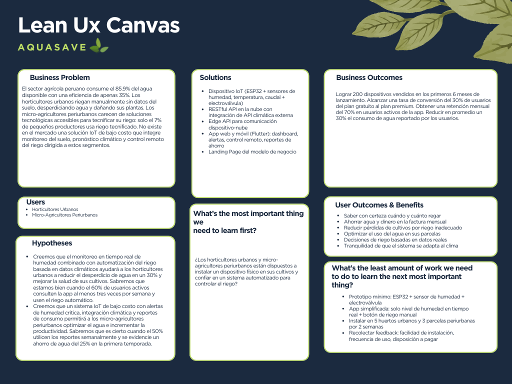

  

    
  

  # 
Universidad Peruana de Ciencias Aplicadas

  ## 
Ingeniería de Software

  
Periodo: 202610

  
1ASI0657 | Desarrollo de Soluciones IOT

  
NRC: 6770

  
Docente: Javier Antonio Prudencio Vidal

  ---
  
   
  
  ## 
Informe del Trabajo Final

  
  
Startup: 

  
Producto: 

  
   
  
  
Integrantes:

  
<code>U202311220</code> - Gutierrez Condo, Maylhy Olinda

  
<code>U202311361</code> - Roca Tineo, Steven Mathew

  
<code>U202311334</code> - Rodríguez Rodríguez, Luis Piero

  
<code>U202123373</code> - Román Pajuelo, Luis Gustavo

  
<code>U20221C362</code> - Silva Morales, Renzo Cesar

    
   
  
  
<i>Ciclo 202601</i>

 

# Registro de Versiones del Informe

# Project Report Collaboration Insights

# Contenido

# Tabla de contenidos

<a href="#student-outcome">Student Outcome</a>

<a href="#capítulo-i-introducción">Capítulo I: Introducción</a>
    <ul>
        <a href="#11-startup-profile">1.1. Startup Profile</a> 
        <ul>
            <a href="#111-descripción-de-la-startup">1.1.1. Descripción de la Startup</a> 
            <a href="#112-perfiles-de-integrantes-del-equipo">1.1.2. Perfiles de integrantes del equipo</a> 
        </ul>
        <a href="#12-solution-profile">1.2. Solution Profile</a> 
        <ul>
            <a href="#121-antecedentes-y-problemática">1.2.1. Antecedentes y problemática</a> 
            <a href="#122-lean-ux-process">1.2.2. Lean UX Process</a> 
            <ul>
                <a href="#1221-lean-ux-problem-statements">1.2.2.1. Lean UX Problem Statements</a> 
                <a href="#1222-lean-ux-assumptions">1.2.2.2. Lean UX Assumptions</a> 
                <a href="#1223-lean-ux-hypothesis-statements">1.2.2.3. Lean UX Hypothesis Statements</a> 
                <a href="#1224-lean-ux-canvas">1.2.2.4. Lean UX Canvas</a> 
            </ul>
        </ul>
        <a href="#13-segmentos-objetivo">1.3. Segmentos objetivo</a> 
    </ul>

<a href="#capítulo-ii-requirements-elicitation--analysis">Capítulo II: Requirements Elicitation & Analysis</a>
    <ul>
        <a href="#21-competidores">2.1. Competidores</a> 
        <ul>
            <a href="#211-análisis-competitivo">2.1.1. Análisis competitivo</a> 
            <a href="#212-estrategias-y-tácticas-frente-a-competidores">2.1.2. Estrategias y tácticas frente a competidores</a> 
        </ul>
        <a href="#22-entrevistas">2.2. Entrevistas</a> 
        <ul>
            <a href="#221-diseño-de-entrevistas">2.2.1. Diseño de entrevistas</a> 
            <a href="#222-registro-de-entrevistas">2.2.2. Registro de entrevistas</a> 
            <a href="#223-análisis-de-entrevistas">2.2.3. Análisis de entrevistas</a> 
        </ul>
        <a href="#23-needfinding">2.3. Needfinding</a> 
        <ul>
            <a href="#231-user-personas">2.3.1. User Personas</a> 
            <a href="#232-user-task-matrix">2.3.2. User Task Matrix</a> 
            <a href="#233-user-journey-mapping">2.3.3. User Journey Mapping</a> 
            <a href="#234-empathy-mapping">2.3.4. Empathy Mapping</a> 
        </ul>
        <a href="#24-big-picture-eventstorming">2.4. Big Picture EventStorming</a> 
        <a href="#25-ubiquitous-language">2.5. Ubiquitous Language</a> 
    </ul>

<a href="#capítulo-iii-requirements-specification">Capítulo III: Requirements Specification</a>
    <ul>
        <a href="#31-user-stories">3.1. User Stories</a> 
        <a href="#32-impact-mapping">3.2. Impact Mapping</a> 
        <a href="#33-product-backlog">3.3. Product Backlog</a> 
    </ul>

<a href="#capítulo-iv-solution-software-design">Capítulo IV: Solution Software Design</a>
    <ul>
        <a href="#41-strategic-level-domain-driven-design">4.1. Strategic-Level Domain-Driven Design</a> 
        <ul>
            <a href="#411-design-level-eventstorming">4.1.1. Design-Level EventStorming</a> 
            <ul>
                <a href="#4111-candidate-context-discovery">4.1.1.1. Candidate Context Discovery</a> 
                <a href="#4112-domain-message-flows-modeling">4.1.1.2. Domain Message Flows Modeling</a> 
                <a href="#4113-bounded-context-canvases">4.1.1.3. Bounded Context Canvases</a> 
            </ul>
            <a href="#412-context-mapping">4.1.2. Context Mapping</a> 
            <a href="#413-software-architecture">4.1.3. Software Architecture</a> 
            <ul>
                <a href="#4131-software-architecture-system-landscape-diagram">4.1.3.1. Software Architecture System Landscape Diagram</a> 
                <a href="#4132-software-architecture-context-level-diagrams">4.1.3.2. Software Architecture Context Level Diagrams</a> 
                <a href="#4133-software-architecture-container-level-diagrams">4.1.3.2. Software Architecture Container Level Diagrams</a> 
                <a href="#4134-software-architecture-deployment-diagrams">4.1.3.3. Software Architecture Deployment Diagrams</a> 
            </ul>
        </ul>
        <a href="#42-tactical-level-domain-driven-design">4.2. Tactical-Level Domain-Driven Design</a> 
        <ul>
            <a href="#42x-bounded-context">4.2.X. Bounded Context</a> 
            <ul>
                <a href="#42x1-domain-layer">4.2.X.1. Domain Layer</a> 
                <a href="#42x2-interface-layer">4.2.X.2. Interface Layer</a> 
                <a href="#42x3-application-layer">4.2.X.3. Application Layer</a> 
                <a href="#42x4-infrastructure-layer">4.2.X.4. Infrastructure Layer</a> 
                <a href="#42x5-bounded-context-software-architecture-component-level-diagrams">4.2.X.5. Bounded Context Software Architecture Component Level Diagrams</a> 
                <a href="#42x6-bounded-context-software-architecture-code-level-diagrams">4.2.X.6. Bounded Context Software Architecture Code Level Diagrams</a> 
                <ul>
                    <a href="#42x61-bounded-context-domain-layer-class-diagrams">4.2.X.6.1. Bounded Context Domain Layer Class Diagrams</a> 
                    <a href="#42x62-bounded-context-database-design-diagram">4.2.X.6.2. Bounded Context Database Design Diagram</a> 
                </ul>
            </ul>
        </ul>
    </ul>

<a href="#capítulo-v-solution-uiux-design">Capítulo V: Solution UI/UX Design</a>
    <ul>
        <a href="#51-style-guidelines">5.1. Style Guidelines</a> 
        <ul>
            <a href="#511-general-style-guidelines">5.1.1. General Style Guidelines</a> 
            <a href="#512-web-mobile-and-iot-style-guidelines">5.1.2. Web, Mobile and IoT Style Guidelines</a> 
        </ul>
        <a href="#52-information-architecture">5.2. Information Architecture</a> 
        <ul>
            <a href="#521-organization-systems">5.2.1. Organization Systems</a> 
            <a href="#522-labeling-systems">5.2.2. Labeling Systems</a> 
            <a href="#523-seo-tags-and-meta-tags">5.2.3. SEO Tags and Meta Tags</a> 
            <a href="#524-searching-systems">5.2.4. Searching Systems</a> 
            <a href="#525-navigation-systems">5.2.5. Navigation Systems</a> 
        </ul>
        <a href="#53-landing-page-ui-design">5.3. Landing Page UI Design</a> 
        <ul>
            <a href="#531-landing-page-wireframe">5.3.1. Landing Page Wireframe</a> 
            <a href="#532-landing-page-mock-up">5.3.2. Landing Page Mock-up</a> 
        </ul>
        <a href="#54-applications-uxui-design">5.4. Applications UX/UI Design</a> 
        <ul>
            <a href="#541-applications-wireframes">5.4.1. Applications Wireframes</a> 
            <a href="#542-applications-wireflow-diagrams">5.4.2. Applications Wireflow Diagrams</a> 
            <a href="#543-applications-mock-ups">5.4.2. Applications Mock-ups</a> 
            <a href="#544-applications-user-flow-diagrams">5.4.3. Applications User Flow Diagrams</a> 
        </ul>
        <a href="#55-applications-prototyping">5.5. Applications Prototyping</a> 
        <a href="#56-iot-device-design">5.6. IoT Device Design</a> 
    </ul>

<a href="#capítulo-vi-product-implementation-validation--deployment">Capítulo VI: Product Implementation, Validation & Deployment</a>
    <ul>
        <a href="#61-software-configuration-management">6.1. Software Configuration Management</a> 
        <ul>
            <a href="#611-software-development-environment-configuration">6.1.1. Software Development Environment Configuration</a> 
            <a href="#612-source-code-management">6.1.2. Source Code Management</a> 
            <a href="#613-source-code-style-guide--conventions">6.1.3. Source Code Style Guide & Conventions</a> 
            <a href="#614-software-deployment-configuration">6.1.4. Software Deployment Configuration</a> 
        </ul>
        <a href="#62-landing-page-services--applications-implementation">6.2. Landing Page, Services & Applications Implementation</a> 
        <ul>
            <a href="#62x-sprint-n">6.2.X. Sprint n</a> 
            <ul>
                <a href="#62x1-sprint-planning-n">6.2.X.1. Sprint Planning n</a> 
                <a href="#62x2-aspect-leaders-and-collaborators">6.2.X.2. Aspect Leaders and Collaborators</a> 
                <a href="#62x3-sprint-backlog-n">6.2.X.3. Sprint Backlog n</a> 
                <a href="#62x4-development-evidence-for-sprint-review">6.2.X.4. Development Evidence for Sprint Review</a> 
                <a href="#62x5-testing-suite-evidence-for-sprint-review">6.2.X.5. Testing Suite Evidence for Sprint Review</a> 
                <a href="#62x6-execution-evidence-for-sprint-review">6.2.X.6. Execution Evidence for Sprint Review</a> 
                <a href="#62x7-services-documentation-evidence-for-sprint-review">6.2.X.7. Services Documentation Evidence for Sprint Review</a> 
                <a href="#62x8-software-deployment-evidence-for-sprint-review">6.2.X.8. Software Deployment Evidence for Sprint Review</a> 
                <a href="#62x9-team-collaboration-insights-during-sprint">6.2.X.9. Team Collaboration Insights during Sprint</a> 
            </ul>
        </ul>
        <a href="#63-validation-interviews">6.3. Validation Interviews</a> 
        <ul>
            <a href="#631-diseño-de-entrevistas">6.3.1. Diseño de Entrevistas</a> 
            <a href="#632-registro-de-entrevistas">6.3.2. Registro de Entrevistas</a> 
            <a href="#633-evaluaciones-según-heurísticas">6.3.3. Evaluaciones según heurísticas</a> 
        </ul>
        <a href="#64-video-about-the-product">6.4. Video About-the-Product</a> 
    </ul>

<a href="#conclusiones">Conclusiones</a>
    <ul>
        <a href="#conclusiones-y-recomendaciones">Conclusiones y recomendaciones</a> 
        <a href="#video-about-the-team">Video About-the-Team</a> 
    </ul>

<a href="#bibliografía">Bibliografía</a>

<a href="#anexos">Anexos</a>

---

# Student Outcome

## Capítulo I: Introducción

### 1.1. Startup Profile

#### 1.1.1. Descripción de la Startup
EcoDrop es una startup tecnológica enfocada en el desarrollo de soluciones IoT para la gestión inteligente del riego en huertos urbanos y parcelas agrícolas de pequeña escala. Esta iniciativa nace como respuesta a la crítica ineficiencia en el uso del agua dentro del sector agrícola peruano, donde la falta de tecnificación genera un desperdicio significativo del recurso hídrico.

Según Ybánez (2023), el sector agrario en Perú emplea aproximadamente el 80% de los recursos hídricos disponibles, pero presenta solo una eficiencia promedio nacional del 35% (párr. 5). Asimismo, Vinelli (2021) señala que "la eficiencia del agua de riego es apenas del 35 %, es decir, existe un alto desperdicio de agua, debido, entre varias razones, a su deficiente aplicación a los predios y el mal estado de conservación de las redes de conducción y distribución" (párr. 4). Esta realidad evidencia la urgente necesidad de implementar herramientas tecnológicas accesibles que permitan optimizar el consumo de agua y brindar a los pequeños productores y horticultores urbanos un control preciso sobre el riego de sus cultivos.

Fundada por estudiantes de Ingeniería de Software de la Universidad Peruana de Ciencias Aplicadas, EcoDrop busca democratizar el acceso a tecnologías de agricultura inteligente, conectando dispositivos IoT con plataformas digitales que faciliten el monitoreo en tiempo real y la toma de decisiones basada en datos para el cuidado eficiente de los cultivos.

**Producto principal**

Su producto principal es AquaSave, un sistema de riego inteligente compuesto por un dispositivo IoT basado en ESP32 con sensores de humedad del suelo, temperatura y caudal, un RESTful API de desarrollo interno que gestiona la lógica de negocio y cruza los datos locales con el pronóstico climático mediante servicios externos, un API que comunica el dispositivo con la nube, una aplicación web y una aplicación móvil desarrollada en Flutter que permiten al usuario monitorear el estado de sus cultivos, visualizar métricas de ahorro hídrico y controlar el sistema de riego en tiempo real desde cualquier lugar. Además, incluye un Landing Page que presenta el modelo de negocio y permite a los visitantes conocer las características de la solución y acceder a las aplicaciones.

De esta manera, AquaSave no solo automatiza el riego activando o deteniendo el suministro de agua según las condiciones reales del suelo y el clima, sino que también empodera a los usuarios con información clara y oportuna para gestionar sus recursos hídricos de forma eficiente y sostenible.

**Visión**

Ser la plataforma líder en Perú en soluciones IoT accesibles para la gestión inteligente del riego, reduciendo el desperdicio de agua en huertos urbanos y parcelas agrícolas de pequeña escala mediante tecnología al alcance de todos.

**Misión**

Proporcionar herramientas tecnológicas asequibles, confiables e intuitivas que permitan a horticultores urbanos y micro-agricultores periurbanos optimizar el uso del agua en sus cultivos, promoviendo prácticas de riego eficientes a través de la integración de dispositivos IoT, datos climáticos y plataformas móviles de monitoreo en tiempo real.

#### 1.1.2. Perfiles de integrantes del equipo

### 1.2. Solution Profile

#### 1.2.1. Antecedentes y problemática

**What – ¿Cuál es el problema?**

En el Perú, el sector agrícola consume el 85.9% del agua disponible en el país según el Diagnóstico Nacional del Agua de la ANA (Arauco Livia, 2025); sin embargo, la eficiencia del agua de riego es apenas del 35%, lo que significa que existe un alto desperdicio del recurso hídrico (Vinelli, 2021). Esta ineficiencia afecta de manera desproporcionada a los pequeños productores: según la Encuesta Nacional Agropecuaria del INEI (2022), solo el 7% de los pequeños y medianos productores utiliza sistemas de riego tecnificado, mientras que entre los grandes productores la cifra asciende al 53% (Arauco Livia, 2025). Para los horticultores urbanos y micro-agricultores periurbanos, la situación es aún más precaria, ya que el riego se realiza de forma completamente manual, sin acceso a datos sobre las condiciones reales del suelo ni del clima, generando un uso excesivo o insuficiente del agua que afecta tanto la salud de los cultivos como la economía familiar.

**When – ¿Cuándo sucede el problema?**

El problema se manifiesta de forma continua a lo largo de todo el año, pero se intensifica durante las temporadas de verano y los períodos de sequía, cuando la demanda hídrica de los cultivos aumenta significativamente y la disponibilidad del recurso disminuye. Zapana Churata (2018) evidenció que el déficit hídrico para cultivos como la alfalfa se presenta durante seis meses al año, particularmente de enero a febrero y de septiembre a diciembre, períodos en los que la evapotranspiración es mayor. Además, el problema ocurre diariamente cada vez que un horticultor o agricultor riega sus plantas sin conocer el nivel real de humedad del suelo, desperdiciando agua en momentos donde el riego no era necesario o, por el contrario, dejando de regar cuando el suelo ya estaba en condiciones críticas.

**Where – ¿Dónde ocurre el problema?**

La problemática se presenta en todo el territorio peruano, con una paradoja hídrica particularmente grave: la vertiente del Pacífico, donde habita el 66% de la población, concentra apenas el 2.2% de los recursos hídricos nacionales (Arauco Livia, 2025). A nivel nacional, apenas el 20% de la superficie agrícola cuenta con riego tecnificado, y Vinelli (2021) señala que "solo el 12 % de los cultivos se riegan bajo sistemas de riego, mientras que el resto usa el riego por gravedad" (párr. 4). En las zonas urbanas de Lima, donde crece la tendencia de huertos domésticos en terrazas, patios y jardines, el riego se realiza de manera artesanal sin ningún tipo de tecnificación. Asimismo, en las áreas periurbanas de ciudades como Lima, Arequipa y Cusco, los micro-agricultores enfrentan limitaciones de infraestructura hídrica que dificultan la adopción de prácticas de riego eficientes.

**Who – ¿Quiénes están involucrados?**

Los principales afectados son los horticultores urbanos, personas que mantienen huertos domésticos en sus viviendas y que carecen de herramientas para gestionar el riego de forma eficiente. También se ven impactados los micro-agricultores periurbanos, pequeños productores con parcelas de menos de 5 hectáreas que dependen del riego para su sustento. Según el INEI (2017), en el Perú existían más de 2 millones 244 mil pequeñas y medianas unidades agropecuarias, de las cuales el 70.4% son conducidas por hombres y el 29.6% por mujeres, con un 53.5% de productores entre 40 y 64 años de edad. De este grupo, solo el 11.4% recibió algún tipo de capacitación y apenas el 5.7% recibió asistencia técnica, lo que refleja una importante brecha en el acceso al conocimiento tecnológico.

**Why – ¿Por qué ocurre esta situación?**

Las causas son múltiples. En primer lugar, la falta de infraestructura de riego tecnificado: Vinelli (2021) señala que de los 55,237 kilómetros de canales de riego evaluados en el Perú, solo el 15% están revestidos, lo que provoca pérdidas enormes por filtración y evaporación. En segundo lugar, según Ybánez (2023) se pierde hasta el 45% del agua que se canaliza para el trabajo en tierras de cultivo debido al mal estado de los canales de riego. En tercer lugar, la baja capacitación tecnológica de los productores, ya que según el INEI (2017) solo el 5.7% recibió asistencia técnica. Además, el costo de las soluciones existentes de agricultura inteligente resulta inaccesible para pequeños productores y horticultores domésticos. Finalmente, la ausencia de herramientas digitales que integren datos del suelo con información climática en tiempo real para la toma de decisiones de riego.

**How – ¿En qué condiciones usarán el producto?**

Los horticultores urbanos y micro-agricultores periurbanos que utilicen AquaSave lo harán desde entornos diversos. El dispositivo IoT basado en ESP32 estará instalado directamente en el huerto o parcela, conectado a sensores de humedad, temperatura y caudal, operando de forma autónoma y continua. Los usuarios accederán a la aplicación web o móvil desde sus smartphones o computadoras para monitorear en tiempo real las condiciones de sus cultivos, revisar el historial de consumo hídrico, recibir alertas cuando la humedad del suelo sea crítica y controlar manualmente el riego cuando lo consideren necesario. La interfaz deberá ser intuitiva y accesible, considerando que según el INEI (2017), el 52.9% de los pequeños productores tienen solo educación primaria.

**How Much – ¿Cuánto cuesta no resolverlo?**

Los costos de no resolver este problema son significativos tanto a nivel económico como ambiental. Según Ybánez (2023), el sector agrario registra pérdidas diarias de hasta S/ 50 millones por problemas asociados a la gestión hídrica. A nivel global, la FAO advierte que para el 2050 habrá un 25% de déficit de agua, lo que afectaría directamente la producción de alimentos. Actualmente, a nivel nacional solo el 20% de la superficie agrícola cuenta con riego tecnificado (Arauco Livia, 2025), lo que implica que la gran mayoría de productores sigue desperdiciando recursos. En contraste, la implementación de sistemas de riego inteligente basados en IoT ha demostrado reducir el consumo de agua entre un 30% y un 50% en comparación con métodos tradicionales, sin afectar el rendimiento de los cultivos. Para un horticultor urbano, esto representa un ahorro directo en la factura de agua y una mejora sustancial en la salud de sus plantas; para un micro-agricultor periurbano, significa mayor productividad con menor inversión en recursos hídricos.

*Tabla 1\.* Brecha de acceso a riego tecnificado en Perú según tipo de productor (2022)

  

_Nota._ Adaptado de "Agricultura inteligente: un puente entre la justicia hídrica y la sostenibilidad empresarial en el Perú", por Arauco Livia, 2025, Infobae, basado en datos de la Encuesta Nacional Agropecuaria del INEI (2022).

#### 1.2.2. Lean UX Process

##### 1.2.2.1. Lean UX Problem Statements

**Problem Statement 1 (Horticultores Urbanos):**

AquaSave ha sido diseñado para ayudar a horticultores urbanos a gestionar el riego de sus huertos domésticos de manera eficiente, mediante un sistema IoT que monitorea las condiciones del suelo en tiempo real e integra datos climáticos para automatizar el suministro de agua.

Hemos observado que las personas que mantienen huertos en sus hogares realizan el riego de forma manual y sin información objetiva sobre el estado real de la humedad del suelo. Esto genera un uso excesivo o insuficiente del agua, provocando el deterioro de las plantas, desperdicio del recurso hídrico y frustración por la falta de control sobre el proceso. Según Arauco Livia (2025), apenas el 20% de la superficie agrícola nacional cuenta con riego tecnificado, y en el ámbito doméstico esta cifra es prácticamente inexistente.

**¿Cómo podemos ofrecer a los horticultores urbanos una herramienta accesible e intuitiva que les permita monitorear y automatizar el riego de sus cultivos, optimizando el consumo de agua y mejorando la salud de sus plantas sin requerir conocimientos técnicos especializados?**

**Problem Statement 2 (Micro-Agricultores Periurbanos):**

AquaSave fue creado con el objetivo de brindar a los micro-agricultores periurbanos una solución IoT de bajo costo que les permita tecnificar el riego de sus parcelas, accediendo a datos en tiempo real sobre humedad, temperatura y pronóstico climático para tomar decisiones informadas sobre el suministro de agua.

Hemos identificado que los pequeños productores agrícolas en zonas periurbanas carecen de herramientas tecnológicas asequibles para gestionar el riego de manera eficiente. Según la Encuesta Nacional Agropecuaria del INEI (2022), solo el 7% de los pequeños y medianos productores utiliza sistemas de riego tecnificado (Arauco Livia, 2025), y apenas el 5.7% recibe asistencia técnica (INEI, 2017). Esta brecha tecnológica provoca pérdidas significativas por desperdicio de agua, menor productividad de los cultivos y un impacto negativo en los ingresos de las familias que dependen de la agricultura.

**¿Cómo podemos facilitar a los micro-agricultores periurbanos el acceso a tecnología de riego inteligente que sea económica, fácil de instalar y que les permita optimizar el uso del agua, incrementar la productividad de sus cultivos y reducir sus costos operativos?**

##### 1.2.2.2. Lean UX Assumptions

1. Creo que mis clientes necesitan una forma accesible y confiable de monitorear las condiciones de humedad y temperatura de sus cultivos en tiempo real, y automatizar el riego según las necesidades reales de sus plantas y el pronóstico del clima.  
2. Estas necesidades se pueden resolver con un sistema IoT compuesto por un dispositivo basado en ESP32 con sensores de humedad, temperatura y caudal, una API en la nube que integre datos climáticos externos, y una aplicación web y móvil que permita visualizar métricas, recibir alertas y controlar el riego de forma remota.  
3. Mis clientes iniciales son (o serán) horticultores urbanos en Lima metropolitana que mantienen huertos domésticos en terrazas, patios o jardines, y micro-agricultores periurbanos con parcelas de menos de 5 hectáreas que buscan tecnificar su riego con soluciones de bajo costo.  
4. El valor \#1 que un cliente quiere de mi servicio es tener el control total sobre el riego de sus cultivos desde su celular, sabiendo que sus plantas reciben la cantidad exacta de agua que necesitan sin desperdiciar el recurso.  
5. El cliente también puede obtener estos beneficios adicionales: ahorro mensual en el consumo de agua, historial detallado de consumo hídrico, prevención de pérdidas de cultivos por riego excesivo o insuficiente, y tranquilidad de saber que el sistema detiene el riego automáticamente cuando se aproxima la lluvia.  
6. Voy a adquirir la mayoría de mis clientes a través de campañas en redes sociales dirigidas a comunidades de jardinería y agricultura urbana, participación en ferias agrícolas y de innovación tecnológica, alianzas con tiendas de jardinería y viveros, y convenios con municipalidades que promuevan huertos urbanos.  
7. Haré dinero a través de la venta del dispositivo IoT (kit ESP32 con sensores y actuador) y un modelo de suscripción mensual con plan básico gratuito (monitoreo en tiempo real) y plan premium (historial completo de consumo, integración con pronóstico climático, alertas inteligentes, reportes de ahorro y control remoto avanzado).  
8. Mi competencia principal en el mercado será aplicaciones de jardinería como Planta o Gardenia que ofrecen recordatorios de riego pero sin datos reales del suelo, temporizadores de riego básicos que funcionan con horarios fijos sin adaptarse a las condiciones del ambiente, y soluciones IoT de agricultura industrial como Gardena Smart o sistemas profesionales de riego de precisión que resultan costosos e inaccesibles para pequeños usuarios.  
9. Los venceremos debido a que ofrecemos una solución integral que combina hardware IoT de bajo costo con software inteligente, específicamente diseñada para huertos urbanos y parcelas pequeñas. A diferencia de las apps de jardinería, nuestro sistema usa datos reales del suelo; a diferencia de los temporizadores, se adapta al clima; y a diferencia de las soluciones industriales, es accesible económicamente.  
10. Mi mayor riesgo de producto es que los usuarios no perciban el valor suficiente como para pagar la suscripción mensual después de adquirir el dispositivo, o que la instalación del hardware les resulte complicada y abandonen el uso del sistema.  
11. Resolveremos esto a través de un proceso de instalación guiado paso a paso dentro de la app, tutoriales en video, un período de prueba gratuita del plan premium al adquirir el dispositivo, y métricas visibles de ahorro de agua que demuestren el retorno de inversión desde las primeras semanas de uso.  
12. **¿Quién es el usuario?** Los usuarios son horticultores urbanos que cultivan en espacios domésticos y buscan optimizar el riego de sus plantas, y micro-agricultores periurbanos con parcelas pequeñas que necesitan tecnificar el riego con soluciones económicas y accesibles.  
13. **¿Dónde encaja nuestro producto en su trabajo o vida?** AquaSave encaja en la rutina diaria del horticultor urbano al eliminar la incertidumbre de cuándo y cuánto regar, y en la operación del micro-agricultor periurbano al automatizar una tarea que consume tiempo y recursos, permitiéndole enfocarse en otras labores productivas.  
14. **¿Qué problemas tiene nuestro producto que resolver?** El riego manual sin datos objetivos del suelo, el desperdicio de agua por riego excesivo o en momentos inadecuados, la falta de herramientas accesibles de monitoreo agrícola para pequeños usuarios, y la desconexión entre las condiciones climáticas y las decisiones de riego.  
15. **¿Cuándo y cómo es nuestro producto usado?** El dispositivo IoT opera de forma continua midiendo las condiciones del suelo. La app se usa diariamente para consultar el estado de los cultivos, revisar alertas y el pronóstico climático. El control manual del riego se activa cuando el usuario lo considera necesario. Los reportes de ahorro se consultan semanal o mensualmente.  
16. **¿Qué características son importantes?** Monitoreo en tiempo real de humedad y temperatura del suelo, automatización del riego basada en umbrales configurables, integración con API de pronóstico climático para pausar el riego ante lluvias, control remoto manual desde la app, historial de consumo hídrico con métricas de ahorro, alertas push cuando la humedad del suelo es crítica, y un diseño responsivo adaptado a dispositivos móviles y web.  
17. **¿Cómo debe verse nuestro producto y cómo comportarse?** Debe verse limpio, moderno y orientado a la naturaleza, con colores verdes y terrosos que transmitan sustentabilidad. Debe comportarse de forma rápida, confiable y simple, mostrando la información más relevante de un vistazo sin requerir conocimientos técnicos. Las acciones críticas como activar el riego o configurar alertas deben estar a máximo dos toques de distancia.  
    

##### 1.2.2.3. Lean UX Hypothesis Statements

**Hypothesis Statement 1 (Horticultores Urbanos):**

Creemos que el monitoreo en tiempo real de la humedad del suelo combinado con la automatización del riego basada en datos climáticos ayudará a los horticultores urbanos a reducir el desperdicio de agua y mejorar la salud de sus cultivos domésticos. Sabremos que estamos bien cuando los usuarios reporten en sus comentarios que se sienten más seguros y en control del riego de sus plantas, cuando al menos el 60% de los usuarios activos consulten la app al menos tres veces por semana y utilicen la función de riego automático, y cuando se observe una reducción promedio del 30% en el consumo de agua reportado por los usuarios durante los primeros dos meses de uso.

**Hypothesis Statement 2 (Micro-Agricultores Periurbanos):**

Creemos que un sistema IoT de riego inteligente de bajo costo con alertas de humedad crítica, integración climática y reportes de consumo hídrico permitirá a los micro-agricultores periurbanos optimizar el uso del agua e incrementar la productividad de sus parcelas. Sabremos que esto es cierto cuando los micro-agricultores reporten que las alertas les han permitido prevenir pérdidas de cultivos por falta o exceso de riego, cuando al menos el 50% de ellos utilicen los reportes de consumo hídrico para tomar decisiones de riego semanalmente, y cuando se evidencie un ahorro de agua de al menos el 25% en comparación con su método de riego anterior durante la primera temporada de uso.

##### 1.2.2.4. Lean UX Canvas

  

### 1.3. Segmentos objetivo

---

## Capítulo II: Requirements Elicitation & Analysis

### 2.1. Competidores

#### 2.1.1. Análisis competitivo

#### 2.1.2. Estrategias y tácticas frente a competidores

### 2.2. Entrevistas

#### 2.2.1. Diseño de entrevistas

#### 2.2.2. Registro de entrevistas

#### 2.2.3. Análisis de entrevistas

### 2.3. Needfinding

#### 2.3.1. User Personas

#### 2.3.2. User Task Matrix

#### 2.3.3. User Journey Mapping

#### 2.3.4. Empathy Mapping

### 2.4. Big Picture EventStorming

### 2.5. Ubiquitous Language

---

## Capítulo III: Requirements Specification

### 3.1. User Stories

### 3.2. Impact Mapping

### 3.3. Product Backlog

---

## Capítulo IV: Solution Software Design

### 4.1. Strategic-Level Domain-Driven Design

#### 4.1.1. Design-Level EventStorming

##### 4.1.1.1. Candidate Context Discovery

##### 4.1.1.2. Domain Message Flows Modeling

##### 4.1.1.3. Bounded Context Canvases

#### 4.1.2. Context Mapping

#### 4.1.3. Software Architecture

##### 4.1.3.1. Software Architecture System Landscape Diagram

##### 4.1.3.2. Software Architecture Context Level Diagrams

##### 4.1.3.2. Software Architecture Container Level Diagrams

##### 4.1.3.3. Software Architecture Deployment Diagrams

### 4.2. Tactical-Level Domain-Driven Design

#### 4.2.X. Bounded Context

##### 4.2.X.1. Domain Layer

##### 4.2.X.2. Interface Layer

##### 4.2.X.3. Application Layer

##### 4.2.X.4. Infrastructure Layer

##### 4.2.X.5. Bounded Context Software Architecture Component Level Diagrams

##### 4.2.X.6. Bounded Context Software Architecture Code Level Diagrams

###### 4.2.X.6.1. Bounded Context Domain Layer Class Diagrams

###### 4.2.X.6.2. Bounded Context Database Design Diagram

---

## Capítulo V: Solution UI/UX Design

### 5.1. Style Guidelines

#### 5.1.1. General Style Guidelines

#### 5.1.2. Web, Mobile and IoT Style Guidelines

### 5.2. Information Architecture

#### 5.2.1. Organization Systems

#### 5.2.2. Labeling Systems

#### 5.2.3. SEO Tags and Meta Tags

#### 5.2.4. Searching Systems

#### 5.2.5. Navigation Systems

### 5.3. Landing Page UI Design

#### 5.3.1. Landing Page Wireframe

#### 5.3.2. Landing Page Mock-up

### 5.4. Applications UX/UI Design

#### 5.4.1. Applications Wireframes

#### 5.4.2. Applications Wireflow Diagrams

#### 5.4.2. Applications Mock-ups

#### 5.4.3. Applications User Flow Diagrams

### 5.5. Applications Prototyping

### 5.6. IoT Device Design

---

## Capítulo VI: Product Implementation, Validation & Deployment

### 6.1. Software Configuration Management

#### 6.1.1. Software Development Environment Configuration

#### 6.1.2. Source Code Management

#### 6.1.3. Source Code Style Guide & Conventions

#### 6.1.4. Software Deployment Configuration

### 6.2. Landing Page, Services & Applications Implementation

#### 6.2.X. Sprint n

##### 6.2.X.1. Sprint Planning n

##### 6.2.X.2. Aspect Leaders and Collaborators

##### 6.2.X.3. Sprint Backlog n

##### 6.2.X.4. Development Evidence for Sprint Review

##### 6.2.X.5. Testing Suite Evidence for Sprint Review

##### 6.2.X.6. Execution Evidence for Sprint Review

##### 6.2.X.7. Services Documentation Evidence for Sprint Review

##### 6.2.X.8. Software Deployment Evidence for Sprint Review

##### 6.2.X.9. Team Collaboration Insights during Sprint

### 6.3. Validation Interviews

#### 6.3.1. Diseño de Entrevistas

#### 6.3.2. Registro de Entrevistas

#### 6.3.3. Evaluaciones según heurísticas

### 6.4. Video About-the-Product

---

## Conclusiones

### Conclusiones y recomendaciones

### Video About-the-Team

---

## Bibliografía

---

## Anexos